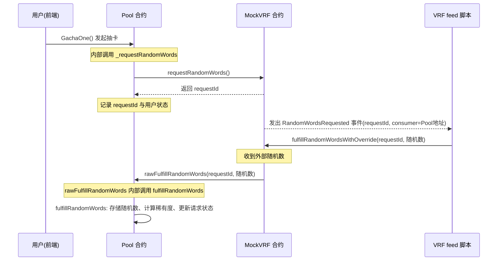
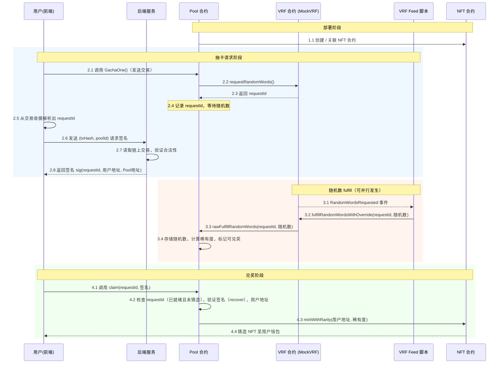

# 流程

## 随机数请求与回调数据流

**数据流动关系**：

- `requestId` 从 MockVRF 流回 Pool，并被事件携带到 feed 脚本。
- 随机数由 feed 脚本注入 MockVRF，再通过 `rawFulfillRandomWords` 流入 Pool。
- Pool 内部最终将随机数转化为抽卡结果。

---

### 整体抽卡‑签名‑兑奖

**关键数据流动**：

- **交易哈希与requestId**：从链上交易流入前端，再给后端。
- **签名**：前端发出请求，由后端生成，返回前端，最终送入合约进行验证。
- **随机数**：通过 feed → MockVRF → `rawFulfillRandomWords` 进入 Pool，与请求绑定。
